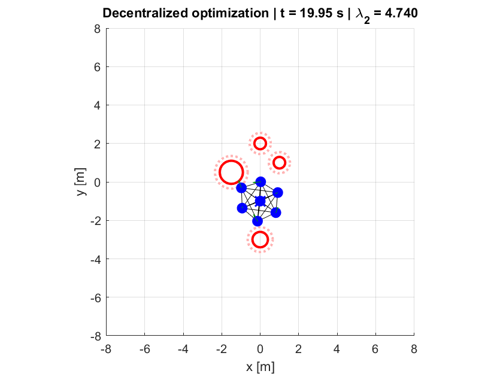
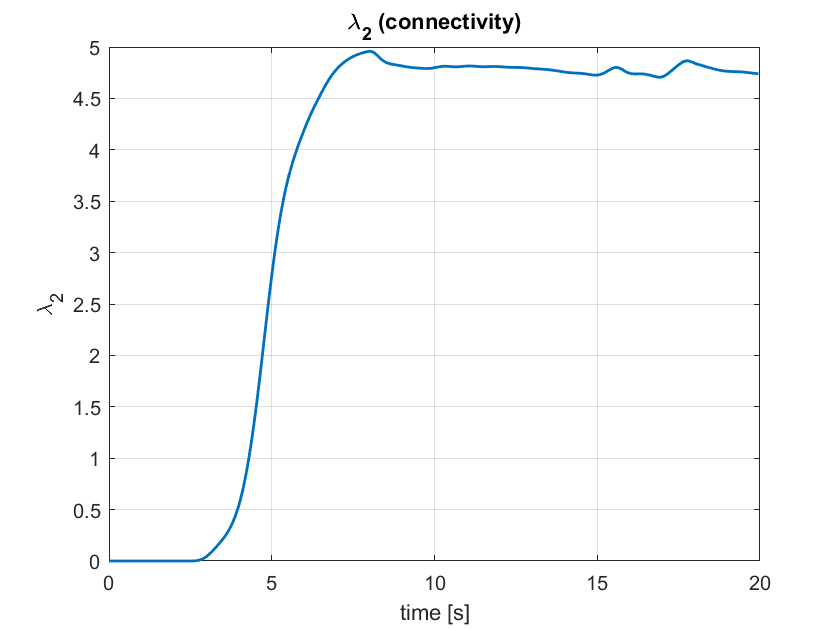
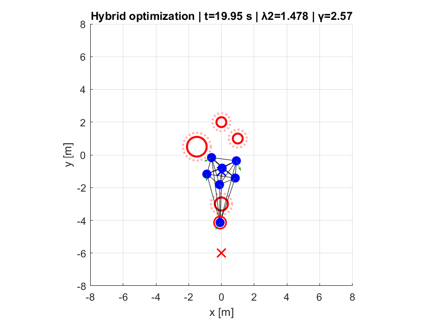
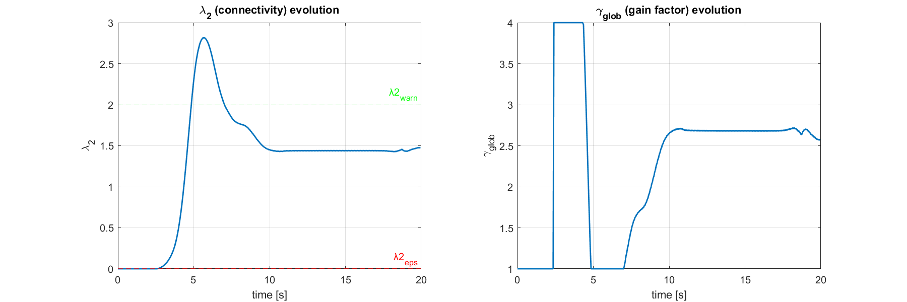
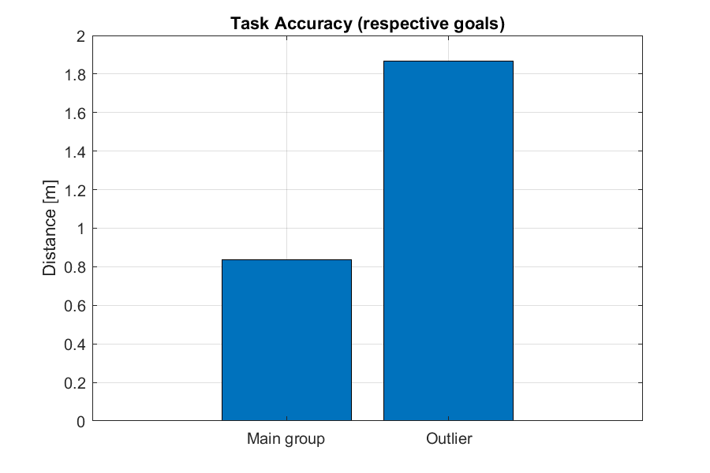
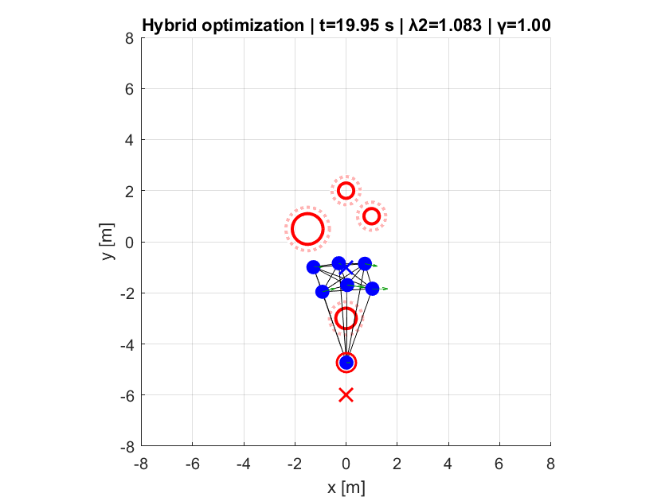
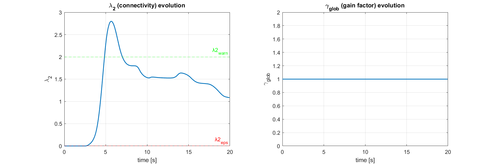
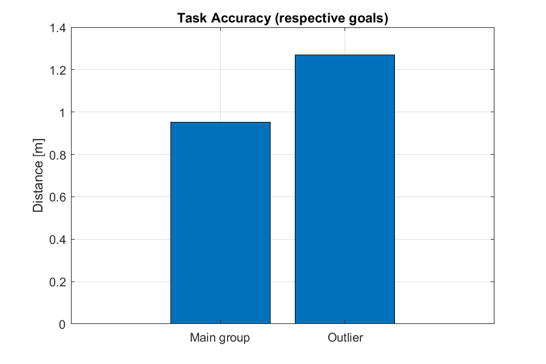

# Analysis and Control of Multi-Robot Systems - Exam project
Project delivered to complete the 4th part of the Elective in Robotics (EiR) course for the Master's degree in ARrtificial intelligence & Robotics (MARR) in Sapienza, University of Rome.

## Table of Contents
- [Overview](#overview)
- [Features](#features)
- [Repository Structure](#repository-structure)
- [Requirements](#requirements)
- [Installation](#installation)
- [(OPTIONAL) Simulink Model](#optional-simulink-model)
- [Examples](#examples)


## Overview
This project focuses on the concept of safety in the context of a multi-agent system. The target is achieved by using Control Barrier Functions (CBFs) in order to impose hard constraints in terms of collision avoidance (agent-agent and agent-obstacle along the path) and connectivity maintenance.


## Features
Each agent in the system is modeled with a double-integrator dynamics, and the main objective is faced with different optimization approaches:

- **Centralized** -> It computes joint accelerations for all agents using a single quadratic program (QP);
- **Decentralized** -> It distributes computation across agents, each of which solves a local QP using only neighbor information;
- **Hybrid** -> It augments the decentralized controller with a connectivity feedback term driven by the global connectivity metric &lambda;<sub>2</sub>.

Differently from the first two approaches, where the agents start with a circular distribution and converges towards the same goal, in the third one, after the formation has reached a predefined level of connectivity, one robot (the outlier) attempts to move away from the formation to reach a different goal. This test is used to see the benefits of the global connectivity gain reinforcement &gamma;~glob on the local controllers wrt standard decentralized approach.\
Everything is released in MATLAB, with the development of custom scripts and functions ad hoc for the project
  

## Repository Structure
The GitHhub repo is organized as the following:

eir-part_4/\
│\
├── optim/\
│ ├── cbf_centralized.m\
│ ├── cbf_decentralized.m\
│ └── cbf_hybrid.m\
│\
├── utils/\
│ ├── incmat_com.m\
│ ├── norm2.m\
│ ├── u_nom_fun.m\
│ └── vecIdx.m\
│\
├── initialization.m\
├── main.m\
├── visualization.m\
└── README.md


## Requirements
Here the mandatory requirements to set the proper environment:

### MATLAB Version
- MATLAB R2022b or higher

### Toolboxes
- Simulink (???)
- Simulink Control Desing (???)
- Optimization Toolbox
- Image Processing Toolbox


## Installation
To set up the environment and run the program, follow the steps in order:

1. Clone/download the repository locally:
   ```bash
   git clone https://github.com/TonyDorek/eir-part_4.git
   ```
2. Open MATLAB and move to the cloned repository as current folder;
3. Open the *initialization.m* script, select the desired optimization approach (variable 'opt_strategy', last line) and run it;
4. Open the *main.m* program, actually a wrapper to the real controllers collected in the "optim" subfolder, and execute it to see a simulation of the multi-agent system dynamics;
5. To plot further results (state evolution, connectivity evolution etc.), open and finally run the *visualization.m* script;
6. To experiment another optimization strategy, restart from point 3.

<u>Note</u>: in the *cbf_hybrid.m* script, to switch to the classic decentralized approach it is possible to deactivate the effects of the global gain (&gamma;~glob) by uncommenting line 65. It is useful to compare it with the activated version (hybrid approach, commented line) and see the differences.

## (OPTIONAL) Simulink Model

- Block diagram purpose
- Key parameters
- Required data files
- Any configuration notes
- ...

## Examples
**Centralized case**\
Main parameters:\
Tsim = 20 -> Simulation time\
N = 7 -> Number of agents\
nObs = 4 -> Number of obstacles\
x_goal = [0 -1] -> Nominal goal for the formation\
R_glob = 5.0 -> Global communication radius (for neighborhood determination)\
R_loc = 4.0 -> Maximum local communication radius (for connectivity constraint)\
dmin = 1.0 -> Minimum distance between robots (for agent collision avoidance constraint)\
rsafe = 0.25 -> Security margin over obstacle radius (for obstacle collision constraint).

Last simulation step:\
\
Connectivity trend:\


**Decentralized case**\
Same parameters.

Last simulation step:\
\
Connectivity trend:\


**Hybrid case**\
Same parameters and others more:\
special_idx = 2 -> Index to select the "special" agent\
x_goal_alt = [0 -6] -> Alternative goal for the special agent (pulls it away from group)\
lambda2_eps = 0 -> Desired minimal global connectivity level\
lambda2_warn  = 2.0 -> Warning threshold (under which triggering the global gain &gamma;).

Two cases:
1) Global gain = on (hybrid control: global + local)\
Last simulation step:\
\
Connectivity trends:\
\
Mean distances from goals:\


2) Global gain = off (decentralized control: fully local)\
Last simulation step:\
\
Connectivity trends:\
\
Mean distances from goals:\



In the last two cases, it is evident that a triggered global gain factor enforces a stronger connectivity (higher &lambda;, more stable formation, outlier more distant from its goal) than the unitary case with pure decentralization (smaller &lambda;, more unstable formation, outlier closer to its goal).

