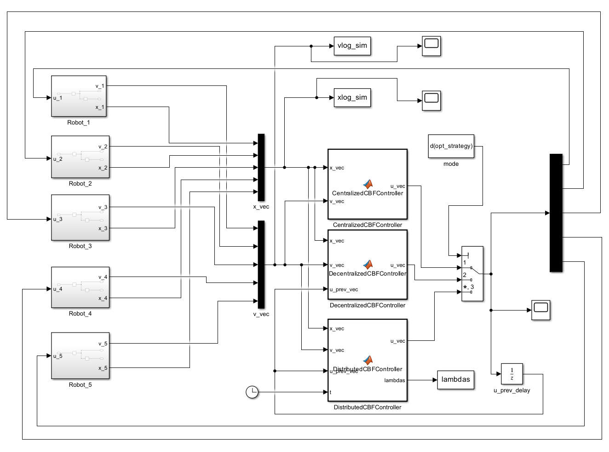
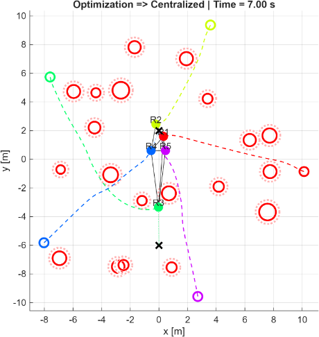
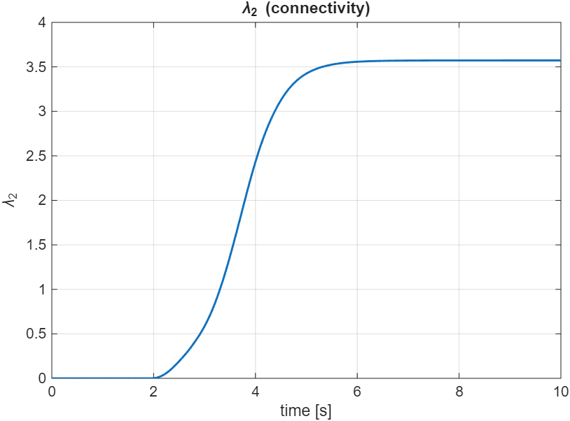
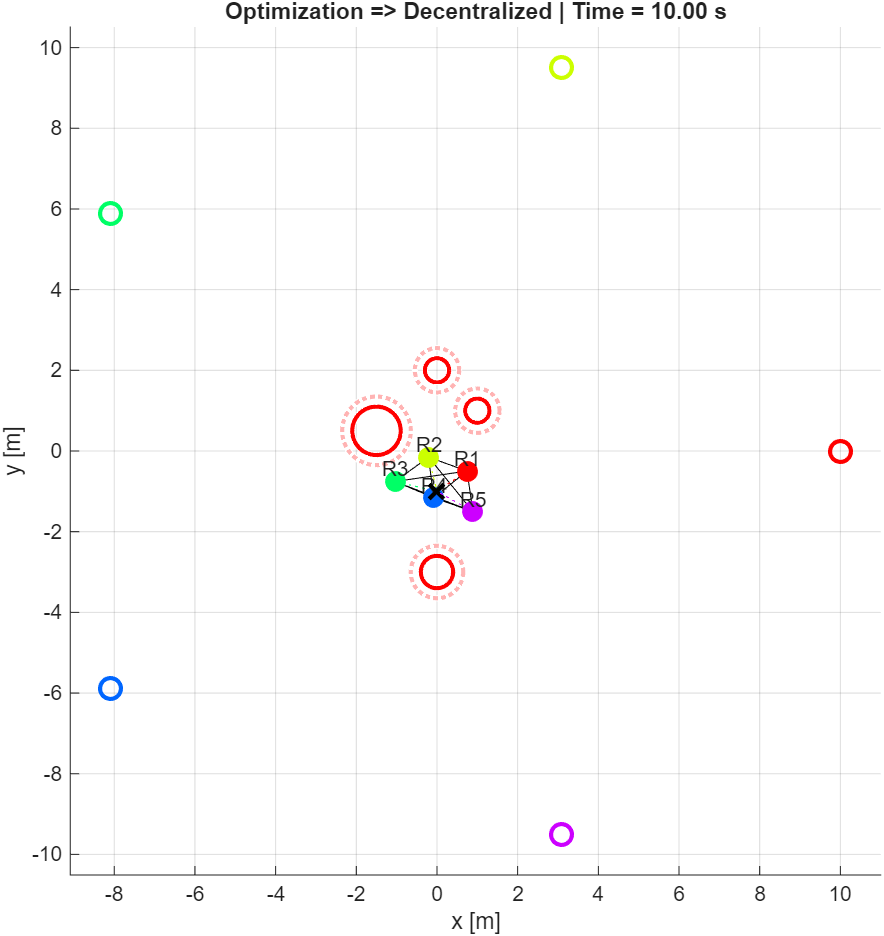
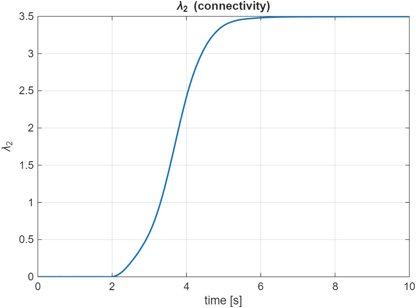
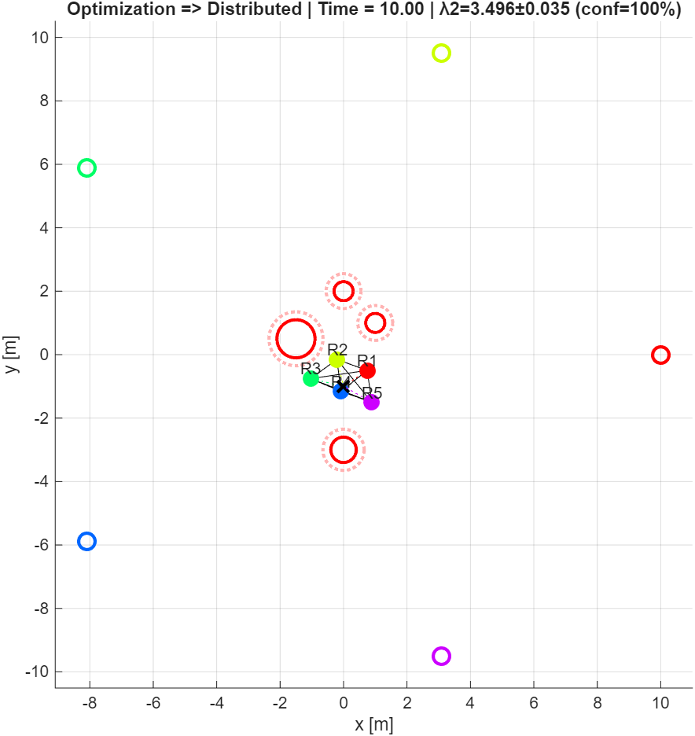
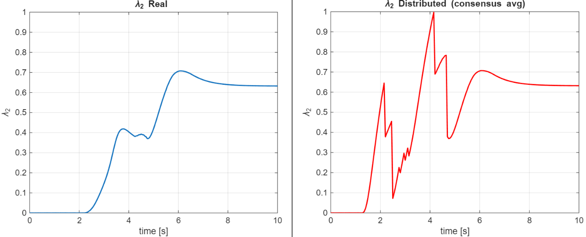

# Multi-Robot Safety Control via Control Barrier Functions

<p align="center">
  
</p>

<p align="center">
  
  
  
  
  
</p>

Project delivered for the 4th part of the **Elective in Robotics (EiR)** course — Master's in Artificial Intelligence & Robotics (MARR), Sapienza University of Rome.

---

## Table of Contents

- [Overview](#overview)
- [Quick Start](#quick-start)
- [Requirements](#requirements)
- [Configuration](#configuration)
- [Control Strategies](#control-strategies)
- [Repository Structure](#repository-structure)
- [Results](#results)
- [References](#references)

---

## Overview

This project addresses **safety in multi-agent systems** through **Control Barrier Functions (CBFs)**. A swarm of N robots (modeled as double integrators in 2D) must reach individual goal positions while satisfying three simultaneous hard constraints:

- **Agent-agent collision avoidance** — robots must stay at least `dmin` apart
- **Obstacle avoidance** — robots must clear all obstacles by a safety margin `rsafe`
- **Connectivity maintenance** — the communication graph must remain connected (algebraic connectivity λ₂ > 0)

Each constraint is encoded as a CBF and enforced via a **Quadratic Program (QP)** that minimally modifies a nominal PD controller to guarantee safety.



---

## Quick Start

### Standard workflow (recommended)

```matlab
% 1. Open MATLAB and set this repository as current folder

% 2. Open initialization.m, choose a strategy and run it
%    (select opt_strategy at the bottom of the file)
initialization

% 3. Run the Simulink model
%    Open simulation/model.slx and press Run, or:
sim('simulation/model')

% 4. Visualize results
visualization
```

### Fast pipeline (one-shot)

```matlab
% Runs init → sim → visualization sequentially
fast_pipeline
```

To switch strategy, change `opt_strategy` in `initialization.m` to one of:

```matlab
opt_strategy = "Centralized";    % or "Decentralized" or "Distributed"
```

---

## Requirements

| Requirement | Version |
|---|---|
| MATLAB | R2022b or higher |
| Simulink | (included in most MATLAB bundles) |
| Optimization Toolbox | Required for `quadprog` (QP solver) |
| Image Processing Toolbox | Required for GIF export in `visualization.m` |

---

## Configuration

All parameters are set in `initialization.m`. The most relevant ones:

### Simulation

| Parameter | Default | Description |
|---|---|---|
| `N` | `5` | Number of robots |
| `Tsim` | `10` | Simulation duration (s) |
| `dt` | `0.05` | Timestep (s) |

### CBF constraints

| Parameter | Default | Description |
|---|---|---|
| `R_glob` | `5.0` | Global communication radius |
| `R_loc` | `R_glob × 0.8` | Max radius for connectivity constraint |
| `dmin` | `1.0` | Min inter-robot distance |
| `rsafe` | `0.25` | Safety margin over obstacle radius |
| `Tpred` | `0.5` | Prediction horizon for obstacle avoidance |

### Distributed approach only

| Parameter | Default | Description |
|---|---|---|
| `lambda2_warn` | `2.0` | λ₂ threshold that triggers the global gain γ |
| `k_lambda_glob` | `3.0` | Gain scaling factor for γ |
| `gamma_max` | `4.0` | Saturation cap for γ |
| `CONFIG.consensus_enabled` | `true` | Enable multi-hop λ₂ consensus |

### Starting configuration flags

| Flag | Default | Description |
|---|---|---|
| `CONFIG.randomize_robots_initpos` | `true` | Randomize initial robot positions |
| `CONFIG.randomize_goals` | `true` | Randomize goal positions |
| `CONFIG.randomize_obstacles` | `true` | Randomize obstacle layout |
| `CONFIG.outlier_random_goal` | `false` | Assign a diverging goal to a random robot |
| `CONFIG.outlier_specific_goal` | `false` | Assign a diverging goal to robot 3 |

---

## Control Strategies

Three optimization approaches are implemented and can be selected at runtime.

### Centralized

A single QP is solved for all N agents simultaneously. It has full global state information and yields the least-conservative solution, but does not scale and requires a central coordinator.

| Last step | Connectivity (λ₂) |
|:---------:|:-----------------:|
|  |  |

### Decentralized

Each agent solves its own local QP using only **neighbor information** (robots within `R_glob`). No central coordinator is needed, but each agent has only partial knowledge of the graph so the connectivity constraint is enforced locally.

| Last step | Connectivity (λ₂) |
|:---------:|:-----------------:|
|  |  |

### Distributed

Extends the decentralized approach with a **distributed estimate of the global algebraic connectivity λ₂**. Each agent:

1. Estimates λ₂ from its local communication graph
2. Refines the estimate via **multi-hop consensus** with neighbors (weighted average, outlier rejection)
3. Blends own estimate with neighbor estimates using a confidence score
4. Triggers a global gain γ when the estimated λ₂ drops below a warning threshold, reinforcing the connectivity constraint

This allows every agent to react to global connectivity degradation without a central node.

| Last step | Connectivity (λ₂) |
|:---------:|:-----------------:|
|  |  |



---

## Repository Structure

```
eir-part_4/
│
├── helpers/                        # All MATLAB functions
│   ├── centralized_cbf_step.m      # QP solver — centralized
│   ├── decentralized_cbf_step.m    # QP solver — decentralized
│   ├── distributed_cbf_step.m      # QP solver — distributed
│   ├── estimate_robot_positions.m  # Multi-hop position propagation
│   ├── blend_estimate.m            # Confidence-weighted position blending
│   ├── robust_consensus.m          # Outlier-robust λ₂ consensus
│   ├── build_adjacency_matrix.m    # Graph construction from estimates
│   ├── extrapolate_position.m      # Dead-reckoning for stale measurements
│   ├── find_connected_component.m  # Graph connectivity utilities
│   ├── incmat_com.m                # Incidence matrix computation
│   ├── u_nom_fun.m                 # Nominal PD controller
│   ├── norm2.m                     # Squared norm helper
│   ├── reshape_log.m               # Simulink log post-processing
│   ├── vecIdx.m                    # Index helper
│   └── print_estimation_debug.m    # Debug printer
│
├── simulation/
│   └── model.slx                   # Simulink model (5-agent system)
│
├── img/                            # Figures used in this README
├── report/                         # PDF report and slides
│
├── initialization.m                # Sets all parameters, must run first
├── visualization.m                 # Plots results and animations after simulation
├── fast_pipeline.m                 # One-shot: init → simulate → visualize
└── README.md
```

---

## Results

<!-- 
    PLACEHOLDER — insert comparison figure here (e.g. side-by-side lambda evolution 
    for all three strategies, or a table of final connectivity values)
-->

Across all three strategies, the CBF constraints successfully prevent collisions and maintain connectivity throughout the simulation. The key trade-off is:

- **Centralized** gives the least-conservative trajectories (global QP), but is not scalable
- **Decentralized** scales well but may be more conservative due to partial graph knowledge
- **Distributed** recovers near-global awareness through consensus, allowing proactive connectivity reinforcement at the cost of additional communication overhead

---

## References

- A. D. Ames, X. Xu, J. W. Grizzle, P. Tabuada — *Control Barrier Function Based Quadratic Programs for Safety Critical Systems*, IEEE TAC 2017
- M. Fiedler — *Algebraic connectivity of graphs*, Czechoslovak Mathematical Journal, 1973
- M. M. Zavlanos, G. J. Pappas — *Controlling Connectivity of Dynamic Graphs*, IEEE CDC 2005
- R. Olfati-Saber, R. M. Murray — *Consensus Problems in Networks of Agents with Switching Topology*, IEEE TAC 2004
