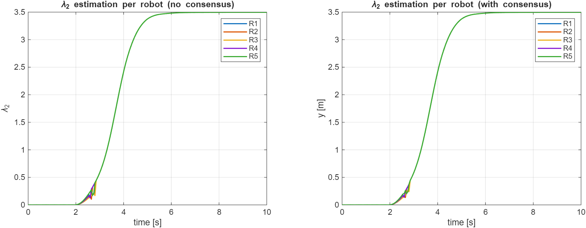

# Analysis and Control of Multi-Robot Systems - Exam project
Project delivered to complete the 4th part of the Elective in Robotics (EiR) course for the Master's degree in ARrtificial intelligence & Robotics (MARR) in Sapienza, University of Rome.

## Table of Contents
- [Overview](#overview)
- [Features](#features)
- [Repository Structure](#repository-structure)
- [Requirements](#requirements)
- [Installation](#installation)
- [Simulink Model](#simulink-model)
- [Examples](#examples)


## Overview
This project focuses on the concept of safety in the context of a multi-agent system. The target is achieved by using Control Barrier Functions (CBFs) in order to impose hard constraints in terms of collision avoidance (agent-agent and agent-obstacle along the path) and connectivity maintenance.


## Features
Each agent in the system is modeled with a double-integrator dynamics, the main objective is faced with different optimization approaches:

- **Centralized** -> It computes joint accelerations for all agents using a single quadratic program (QP);
- **Decentralized** -> It distributes computation across agents, each of which solves a local QP using only neighbor information;
- **Distributed** -> It augments the decentralized controller with a local connectivity feedback term driven by the global connectivity metric &lambda;<sub>2</sub>; this factor is estimated by each agent through multi-hop communication and consensus mechanisms.

Independently from the chosen approach, it is possible to set the initial agent positions, the goal position, the obstacle position or to randomize everything, including an outlier agent which will move and stay in disconnection from the swarm.
<!---
Differently from the first two approaches, where the agents start with a circular distribution and converges towards the same goal, in the third one, after the formation has reached a predefined level of connectivity, one robot (the outlier) attempts to move away from the formation to reach a different goal. This test is used to see the benefits of the global connectivity gain reinforcement &gamma;<sub>glob</sub> on the local controllers wrt standard decentralized approach.\
Everything is released in MATLAB, with the development of custom scripts and functions ad hoc for the project.
-->
  

## Repository Structure
The GitHub repo is mainly organized as:

eir-part_4/\
│\
|├── helpers/\
| ├──[...]\
| ├── cbf_centralized_step.m\
| ├── cbf_decentralized_step.m\
| ├── cbf_distributed_step.m\
| └── [...]\
│\
|├── simulation/\
| └── model.slx\
│\
|├── initialization.m\
|├── visualization.m\
|└── README.md

In particular:
- "initialization.m" script -> It saves the configurations, parameters and variables to be set before running the model
- "visualization.m" script -> It plots the results of the model, from the animations to the output variables
- "helpers" subfolder -> It collects all the functions used in the program
- "simulation" subfolder -> It stores the Simulink model of the system

There are other accessory subfolders, like "img" and "report" (with the images in the .md file and the project report in PDF, respectively) that are not important in terms of software implementation.

## Requirements
Here the mandatory requirements to set the proper environment:

### MATLAB Version
- MATLAB R2022b or higher

### Plug-ins
- Simulink
- Optimization Toolbox
- Image Processing Toolbox


## Installation
To set up the environment and run the program, follow the steps in order:

1. Clone/download the repository locally:
   ```bash
   git clone https://github.com/TonyDorek/eir-part_4.git
   ```
2. Open MATLAB and move to the cloned repository as current folder;
3. Open the *initialization.m* script, select the desired optimization approach (variable 'opt_strategy', last line) and run it;
4. Open the *model.slx* in Simulink and run the simulation;
5. Open the *visualization.m* to see a simulation of the multi-agent system dynamics and to plot further results (state evolution, connectivity evolution etc.);
7. To experiment another optimization strategy, restart from point 3.

<!---
<u>Note</u>: in the *cbf_hybrid.m* script, to switch to the classic decentralized approach it is possible to deactivate the effects of the global gain (&gamma;<sub>glob</sub>) by uncommenting line 65. It is useful to compare it with the activated version (hybrid approach, commented line) and see the differences.
-->
## Simulink Model
A picture of the Simulink model is in the following:


The multi-agent system is composed by 5 robots, modeled on the left side (each of them represented with an independent double-integrator sub-block); all the state signals are collected in the central part through multiplexers that passed everything to the 3 controllers, each one for type of optimization; on the right side, a switch selects the output (actually the input) of the system related to the desired logic (one of the 3), before closing the loop with a feedback that takes this variable back to the 5 agents. Connected blocks are used to save relevant objects, like the state and the algebraic connectivity, in workspace for future processings.

## Examples
**Centralized case**\
Main parameters:\
Tsim = 10 -> Simulation time\
N = 5 -> Number of agents\
nObs = 4 -> Number of obstacles\
x_goal = [0 -1] -> Nominal goal for the formation\
R_glob = 5.0 -> Global communication radius (for neighborhood determination)\
R_loc = 4.0 -> Maximum local communication radius (for connectivity constraint)\
dmin = 1.0 -> Minimum distance between robots (for agent collision avoidance constraint)\
rsafe = 0.25 -> Security margin over obstacle radius (for obstacle collision constraint).

Last simulation step:\
\
Connectivity trend:\


**Decentralized case**\
Same parameters.

Last simulation step:\
\
Connectivity trend:\


**Distributed case**\
Same parameters and others more:\
lambda2_eps = 0 -> Desired minimal global connectivity level\
lambda2_warn  = 2.0 -> Warning threshold (under which triggering a global gain &gamma; that reinforces the local connectivity gain).

Last simulation step:\
\
Connectivity trend:\



The difference between estimation with or without consensus is that, in the latter case, each robot estimates &lambda; basing only on the knowledge acquired during motion, while in the first case this "personal" estimation is corrected with a weighted-&lambda; term coming from all the other agents. The mean value of these evolutions is then reported in the single plot above them.

<!---
In the last two cases, it is evident that a triggered global gain factor enforces a stronger connectivity (higher &lambda;, more stable formation, outlier more distant from its goal) than the unitary case with pure decentralization (smaller &lambda;, more unstable formation, outlier closer to its goal).
-->